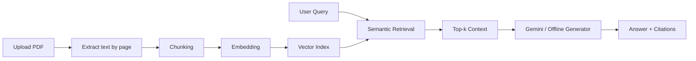

# 📚 Simple NotebookLM — RAG Learning Assistant

Dự án mô phỏng một phiên bản **NotebookLM đơn giản** dành cho học tập từ tài liệu PDF.

## Chức năng chính

1. **Hỏi đáp theo tài liệu (RAG)** — truy xuất các đoạn liên quan và trả lời kèm nguồn file/trang.
2. **Tóm tắt tài liệu** — tạo bản tóm tắt ngắn gọn và các ý chính.
3. **Tạo Quiz** — sinh câu hỏi trắc nghiệm từ nội dung PDF.
4. **Tạo Flashcards** — sinh thẻ hỏi/đáp để ôn tập.

## Công nghệ

- Python 3.10+
- Streamlit
- PyMuPDF
- Sentence Transformers
- scikit-learn
- Google Gemini 2.5 Flash (tùy chọn)
- python-dotenv

> Ứng dụng có **Offline Demo Mode** để vẫn chạy khi chưa cấu hình Gemini API Key. Khi có API key, hệ thống dùng Gemini để tạo nội dung tự nhiên hơn.

## Cấu trúc

```text
.
├── app.py
├── requirements.txt
├── .env.example
├── .gitignore
├── data/
│   └── README.md
├── docs/
│   ├── PRESENTATION.md
│   └── ui-preview.svg
└── README.md
```

## Cài đặt

```bash
git clone https://github.com/dvt1903/doan-van-tam.git
cd doan-van-tam
python -m venv .venv
```

### Windows

```bash
.venv\Scripts\activate
pip install -r requirements.txt
copy .env.example .env
streamlit run app.py
```

### macOS / Linux

```bash
source .venv/bin/activate
pip install -r requirements.txt
cp .env.example .env
streamlit run app.py
```

Mở trình duyệt tại `http://localhost:8501`.

## Cấu hình Gemini (không bắt buộc)

Trong file `.env`:

```env
GOOGLE_API_KEY=YOUR_API_KEY
GEMINI_MODEL=gemini-2.5-flash
```

Nếu không có `GOOGLE_API_KEY`, ứng dụng tự chuyển sang **Offline Demo Mode**.

## Cách demo trên lớp

1. Chạy `streamlit run app.py`.
2. Upload 1–3 file PDF.
3. Bấm **Index documents**.
4. Mở tab **Hỏi đáp**, nhập câu hỏi về nội dung PDF.
5. Kiểm tra phần **Nguồn tham khảo** bên dưới câu trả lời.
6. Chuyển sang **Tóm tắt**, **Quiz**, **Flashcards** để demo đủ 4 chức năng AI.

## Luồng RAG



## AI sử dụng

- **Runtime LLM:** Google Gemini 2.5 Flash (khi có API key).
- **Embedding:** `sentence-transformers/paraphrase-multilingual-MiniLM-L12-v2`.
- **AI hỗ trợ phát triển:** ChatGPT — GPT-5.6 Sol.

## Lưu ý bảo mật

- Không commit `.env` hoặc API key lên GitHub.
- `.gitignore` đã bỏ qua `.env`, môi trường ảo và file tạm.

## Tài liệu thuyết trình

Xem `docs/PRESENTATION.md` để có nội dung slide ngắn gọn và phần demo.

---

**Sinh viên:** Đoàn Văn Tâm  
**Mục đích:** Bài tập môn AI — Building a Simple NotebookLM
